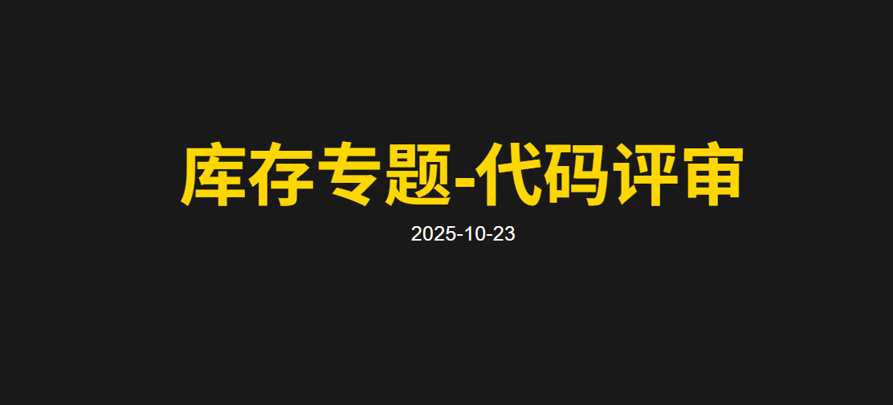
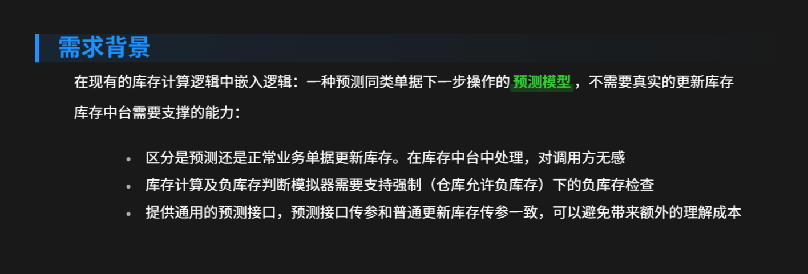
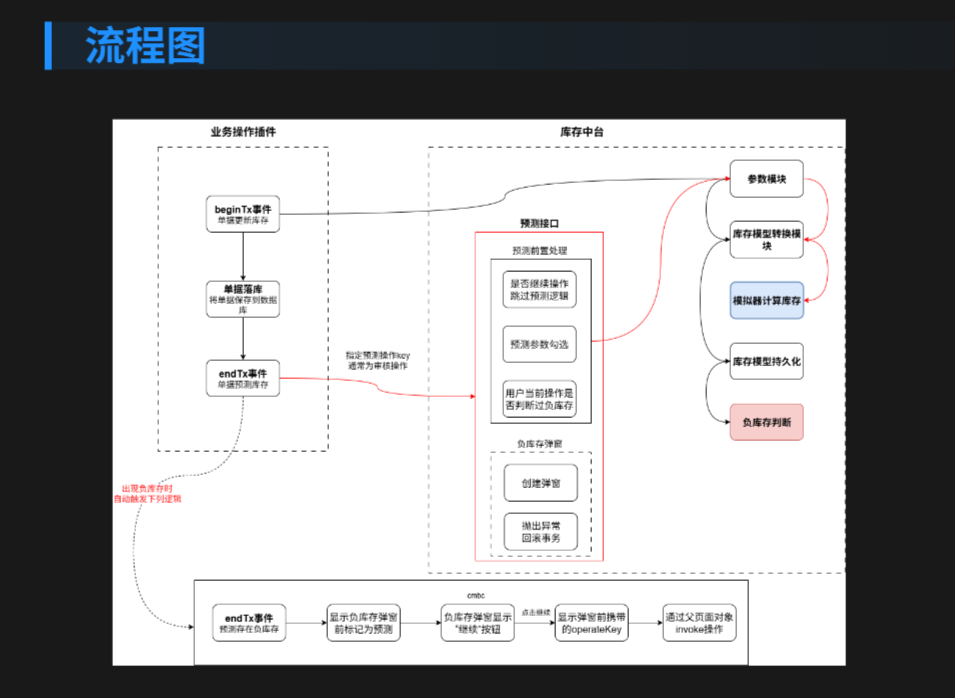

obsidian 这个强大的笔记软件，有一个很 demo 的演示 markdown 的能力，如果你对该 demo 进一步优化，将可以得到一个非常轻量级的 PPT 工具，直接将 markdown 渲染成 PPT。这对于热衷于 markdown 的开发人而言，简直是福音。

<!--more-->

## 效果图

H1 标题的实现效果图：



段落的实现效果图：



H2 标题及图片实现效果图：



## css Demo 

该 css 脚本具备的功能如下：

- 指定元素字体大小
- 列表居左显示
- 标题指定颜色显示
- 图片多种方式显示

这个可以根据需要进行调整，代码片段里面已经进行了详细的备注。

```css
/* Obsidian Slides 优化样式 */

/* ==================== */
/* 根元素字体大小设置 */
/* ==================== */

.reveal .slides {
  font-size: 18px; /* 基础字体大小 - 可根据需要调整 */
  line-height: 1.4;
  height: 100vh;
}
.reveal .slides section p {
  text-align: left !important;
  margin: 0.8em 0;
  line-height: 1.3;
  max-width: 90%;
  margin-left: auto;
  margin-right: auto;
}

/* ==================== */
/* 列表居左设置 */
/* ==================== */

.reveal .slides section ul,
.reveal .slides section ol {
  text-align: left !important;
  margin: 0.5em auto;
  padding-left: 1.5em;
  max-width: 90%;
  list-style-position: inside;
}

.reveal .slides section li {
  text-align: left !important;
  margin: 0.4em 0;
  line-height: 1.5;
}


/* ==================== */
/* 标题样式优化 */
/* ==================== */

/* H1 标题 - 金黄色 */
.markdown-preview-view .slide h1,
.reveal .slides section h1 {
  color: #FFD700 !important; /* 金黄色 */
  text-align: center;
  font-size: 1.8em !important;
  font-weight: 700;
  margin-bottom: 0.5em;
  text-shadow: 2px 2px 4px rgba(0, 0, 0, 0.3);
  border-bottom: 3px solid #FFD700;
  padding-bottom: 0.3em;
  background: linear-gradient(135deg, transparent 0%, rgba(255, 215, 0, 0.1) 100%);
  border-radius: 8px;
  padding: 0.5em;
}

/* H2 标题 - 蓝色 */
.markdown-preview-view .slide h2,
.reveal .slides section h2 {
  color: #1E90FF !important; /* 道奇蓝 */
  text-align: left;
  font-size: 1.6em !important;
  font-weight: 600;
  margin: 1em 0 0.5em 0;
  border-left: 5px solid #1E90FF;
  padding-left: 0.8em;
  background: linear-gradient(90deg, rgba(30, 144, 255, 0.1) 0%, transparent 100%);
  border-radius: 0 8px 8px 0;
}

/* H3 标题 - 紫色渐变 */
.markdown-preview-view .slide h3,
.reveal .slides section h3 {
  color: #9370DB !important; /* 中紫色 */
  font-size: 1.4em !important;
  font-weight: 600;
  margin: 0.8em 0 0.3em 0;
  border-bottom: 2px dashed #9370DB;
  padding-bottom: 0.2em;
}

/* ==================== */
/* 加粗文本 - 绿色 */
/* ==================== */

.markdown-preview-view .slide strong,
.reveal .slides section strong,
.markdown-preview-view .slide .cm-strong,
.reveal .slides section .cm-strong {
  color: #32CD32 !important; /* 酸橙绿 */
  font-weight: 700;
  background: linear-gradient(transparent 60%, rgba(50, 205, 50, 0.2) 40%);
  padding: 0.1em 0.2em;
  border-radius: 3px;
}

/* 加粗文本在列表中的样式 */
.markdown-preview-view .slide li strong,
.reveal .slides section li strong {
  color: #32CD32 !important;
  background: linear-gradient(transparent 60%, rgba(50, 205, 50, 0.15) 40%);
}

/* ==================== */
/* 图片容器样式 */
/* ==================== */
/* 图片样式 - 无遮罩 */
.markdown-preview-view .slide .image-embed img,
.reveal .slides section img {
  /* 基础图片样式 */
  max-width: 100%;
  max-height: 90vh;
  height: auto;
  width: auto;
  object-fit: contain;
  
  /* 移除遮罩效果 */
  background: none !important;
  box-shadow: none !important;
  border: none !important;
  filter: none !important;
  
  /* 确保图片清晰显示 */
  image-rendering: -webkit-optimize-contrast;
  image-rendering: crisp-edges;
}

.markdown-preview-view .slide .image-embed,
.reveal .slides section .image-embed {
  background: transparent !important;
  padding: 0 !important;
  margin: 1em auto !important;
  text-align: center;
}

/* 图片标题样式 */
.markdown-preview-view .slide .image-embed + p,
.reveal .slides section .image-embed + p {
  font-size: 0.8em;
  color: var(--text-muted);
  margin-top: 0.5em;
  text-align: center;
  font-style: italic;
}

/* ==================== */
/* 特殊图片样式 */
/* ==================== */

/* 全屏图片样式 */
.markdown-preview-view .slide .image-embed[alt*="full"],
.reveal .slides section img[alt*="full"] {
  max-width: 95vw;
  max-height: 95vh;
}

/* 居中图片样式 */
.markdown-preview-view .slide .image-embed[alt*="center"],
.reveal .slides section img[alt*="center"] {
  display: block;
  margin: 0 auto;
}

/* 左侧对齐图片 */
.markdown-preview-view .slide .image-embed[alt*="left"],
.reveal .slides section img[alt*="left"] {
  float: left;
  margin-right: 2em;
  margin-bottom: 1em;
  max-width: 45%;
}

/* 右侧对齐图片 */
.markdown-preview-view .slide .image-embed[alt*="right"],
.reveal .slides section img[alt*="right"] {
  float: right;
  margin-left: 2em;
  margin-bottom: 1em;
  max-width: 45%;
}

/* 小尺寸图片 */
.markdown-preview-view .slide .image-embed[alt*="small"],
.reveal .slides section img[alt*="small"] {
  max-width: 40%;
  max-height: 50vh;
}

/* 中等尺寸图片 */
.markdown-preview-view .slide .image-embed[alt*="medium"],
.reveal .slides section img[alt*="medium"] {
  max-width: 60%;
  max-height: 70vh;
}

/* ==================== */
/* 其他元素样式 */
/* ==================== */

/* 清除浮动 */
.markdown-preview-view .slide::after,
.reveal .slides section::after {
  content: "";
  display: table;
  clear: both;
}

/* 代码样式 */
.markdown-preview-view .slide code,
.reveal .slides section code {
  background: rgba(100, 100, 100, 0.1);
  color: #E74C3C;
  padding: 0.2em 0.4em;
  border-radius: 3px;
  font-family: 'Courier New', monospace;
}

.markdown-preview-view .slide pre,
.reveal .slides section pre {
  background: #2D3748;
  color: #E2E8F0;
  padding: 1em;
  border-radius: 8px;
  overflow-x: auto;
  border-left: 4px solid #4A5568;
}

/* 引用样式 */
.markdown-preview-view .slide blockquote,
.reveal .slides section blockquote {
  border-left: 4px solid #FFD700; /* 金黄色边框 */
  background: rgba(255, 215, 0, 0.05);
  padding: 0.8em 1em;
  margin: 1em 0;
  border-radius: 0 8px 8px 0;
  font-style: italic;
}

/* ==================== */
/* 图片网格布局 */
/* ==================== */

.markdown-preview-view .slide .image-grid,
.reveal .slides section .image-grid {
  display: grid;
  grid-template-columns: repeat(auto-fit, minmax(200px, 1fr));
  gap: 1em;
  margin: 1em 0;
}

.markdown-preview-view .slide .image-grid img,
.reveal .slides section .image-grid img {
  width: 100%;
  height: 150px;
  object-fit: cover;
  border-radius: 8px;
}

/* ==================== */
/* 背景图片幻灯片 */
/* ==================== */

.markdown-preview-view .slide[data-background-image],
.reveal .slides section[data-background-image] {
  background-size: contain !important;
  background-repeat: no-repeat !important;
  background-position: center !important;
  background-color: transparent !important;
}

/* 背景图片幻灯片中的文字反色 */
.markdown-preview-view .slide[data-background-image] h1,
.reveal .slides section[data-background-image] h1,
.markdown-preview-view .slide[data-background-image] h2,
.reveal .slides section[data-background-image] h2 {
  text-shadow: 2px 2px 8px rgba(0, 0, 0, 0.8);
  background: rgba(0, 0, 0, 0.5);
  padding: 0.5em;
  border-radius: 8px;
}

/* ==================== */
/* 主题适配 */
/* ==================== */

/* 深色主题适配 */
.theme-dark .markdown-preview-view .slide img,
.theme-dark .reveal .slides section img {
  filter: none !important;
  opacity: 1 !important;
}

.theme-dark .markdown-preview-view .slide h1,
.theme-dark .reveal .slides section h1 {
  color: #FFD700 !important; /* 保持金黄色 */
  text-shadow: 2px 2px 6px rgba(0, 0, 0, 0.5);
}

.theme-dark .markdown-preview-view .slide h2,
.theme-dark .reveal .slides section h2 {
  color: #1E90FF !important; /* 保持蓝色 */
}

.theme-dark .markdown-preview-view .slide strong,
.theme-dark .reveal .slides section strong {
  color: #32CD32 !important; /* 保持绿色 */
}

/* 打印样式 */
@media print {
  .markdown-preview-view .slide img,
  .reveal .slides section img {
    max-width: 100% !important;
    max-height: none !important;
    page-break-inside: avoid;
  }
  .reveal .slides section {
    overflow-y: visible !important;
    max-height: none !important;
  }
  .markdown-preview-view .slide h1,
  .reveal .slides section h1 {
    color: #B8860B !important; /* 打印时使用深一点的金色 */
  }
}

/* ==================== */
/* 动画效果（可选） */
/* ==================== */

/* 标题进入动画 */
.reveal .slides section h1 {
  animation: slideInDown 0.8s ease-out;
}

.reveal .slides section h2 {
  animation: slideInLeft 0.8s ease-out 0.2s both;
}

@keyframes slideInDown {
  from {
    opacity: 0;
    transform: translateY(-30px);
  }
  to {
    opacity: 1;
    transform: translateY(0);
  }
}

@keyframes slideInLeft {
  from {
    opacity: 0;
    transform: translateX(-30px);
  }
  to {
    opacity: 1;
    transform: translateX(0);
  }
}
```

## 将 css 置入 obsidian

请参考 obsidian 的官方文档，这里不再赘述。[css 代码片段](https://publish.obsidian.md/help-zh/%E6%89%A9%E5%B1%95+Obsidian/CSS+%E4%BB%A3%E7%A0%81%E7%89%87%E6%AE%B5)