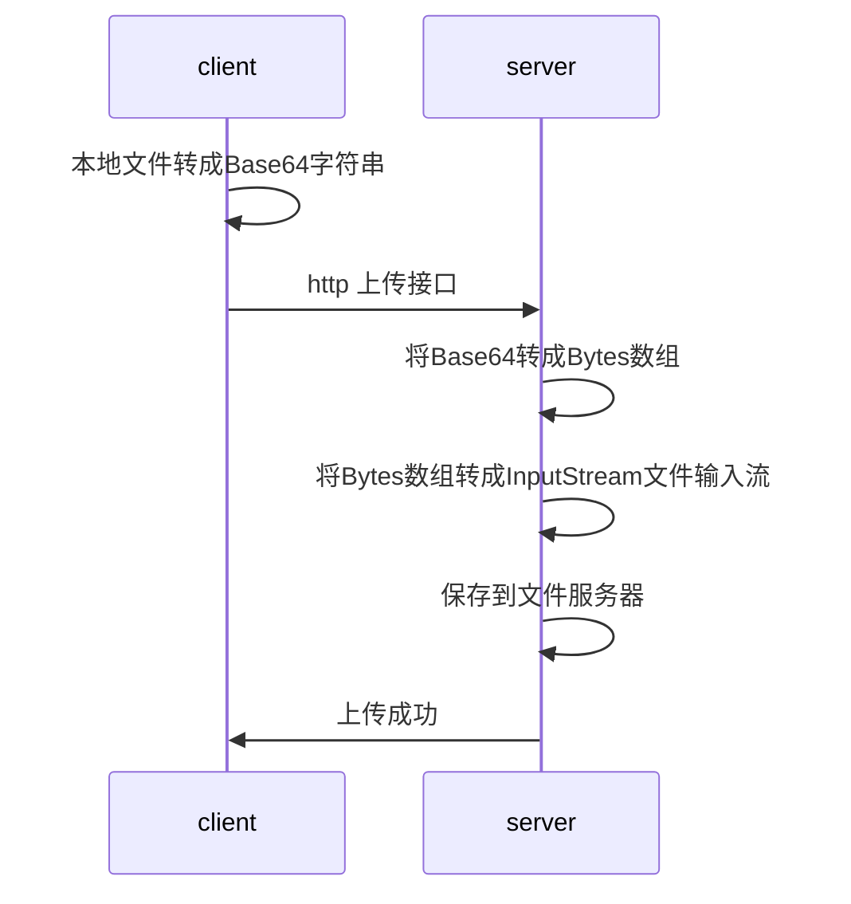
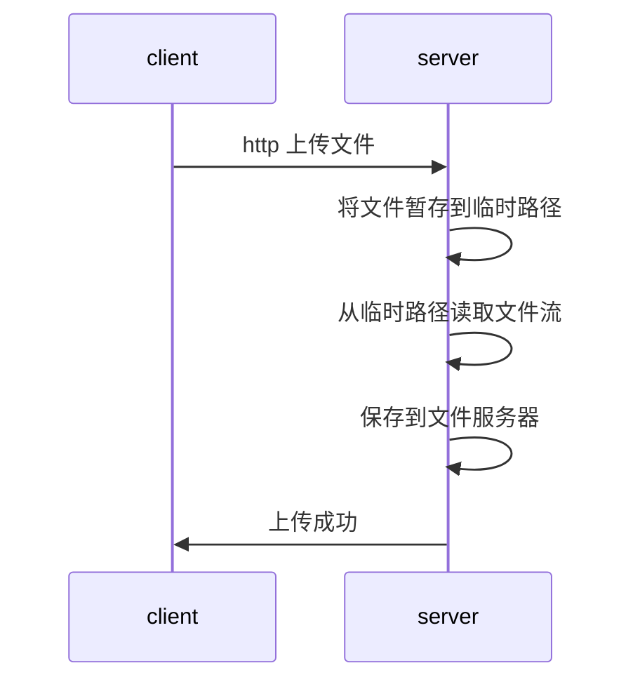

想要上传文件，服务器不支持文件流传输怎么办？

​在做开放接口的时候，遇到个问题就是如何通过HTTP上传一个图片，考虑到接口的传输只支持json（API程序的限制），所以优先考虑**前端先将图片转成base64字符串，再上传字符串给后端**。

<!--more-->

# 文件上传方法

​后端在做上传文件到服务器时，需要用到文件流（inputstream），所以这也可以考虑两种方式：

- 一种是直接上传
- 另外一种是先将base64转成图片保存到临时路径下，再通过保存的图片拿到文件流。

下面具体看下两种获取流的方式的实现：

## 直接上传Base64到服务器

方式一：直接上传到服务器（据说没有第二种方式可靠，个人觉得效率会高一些，期间减少了流的操作）



实现思路：将base64转成bytes数组，bytes数组再转成输入流；

```java
// 代码实现
//1.将字符串去掉头部信息image转换为byte数组，file为完整的base64字符串
byte[] bytes = new BASE64Decoder().decodeBuffer(file.trim().split(",")[1]);
for (int i = 0; i < bytes.length; ++i) {
    if (bytes[i] < 0) {// 调整异常数据
        bytes[i] += 256;
    }
}
//2.转化为输入流
InputStream imageStream = new ByteArrayInputStream(bytes);
```

## 缓存到应用服务器临时路径

方式二：先缓存到临时路径（事后需要删除缓存的图片）



```java
// 代码实现
// 1.调用自己写的帮助类，保存。tempDir为指定的保存路径，包含文件名和后缀
boolean isSave = Base64Convert.generateImage(file, tempDir);
// 2.通过路径找到文件生成一个文件流
InputStream imageStream = new FileInputStream(tempDir);
```

这种方式需要对文件进行多次写入和读取，开销较大。

# 经验总结

在开发过程中遇到的坑：上传文件（图片）成功，但是size为0，一开始一直没有找到问题所在，还以为是自己的实现方式有问题，后来经过排查，发现原来是自己调用了一次ImageIO.read(stream)，将流给使用了（**流只能消费一次**），所以后面的流就变了。