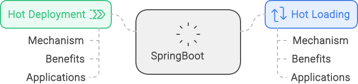

<!--more-->

# Java的热部署与热加载联系：
- 1、不重启服务器编译/部署项目；
- 2、基于Java的类加载器。
# Java的热部署与热加载区别：
## 基本上：
- 1、热部署在服务器运行时重新部署项目；
- 2、热加载在运行时重新加载class。
## 实现原理上：
- 1、热部署直接重新加载整个应用程序；
- 2、热加载在运行时重新加载class
## 使用场景上：
- 1、热部署更多的是在生产环境使用；
- 2、热加载则更多的是在开发环境使用

# 热部署原理解析：
## Java类加载器特点：
- 1、由AppClassLoader（系统类加载器）开始； 
- 2、类加载器将加载任务交给其父类，如果父类找不到，再由自己去加载；
- 3、Bootstrap Loader（启动类加载器）是最顶级的类加载器。
## Java类的热部署实现：
- 1、类的热加载：继承findclass
- 2、配置tomcat：有三种方式(自己Google)