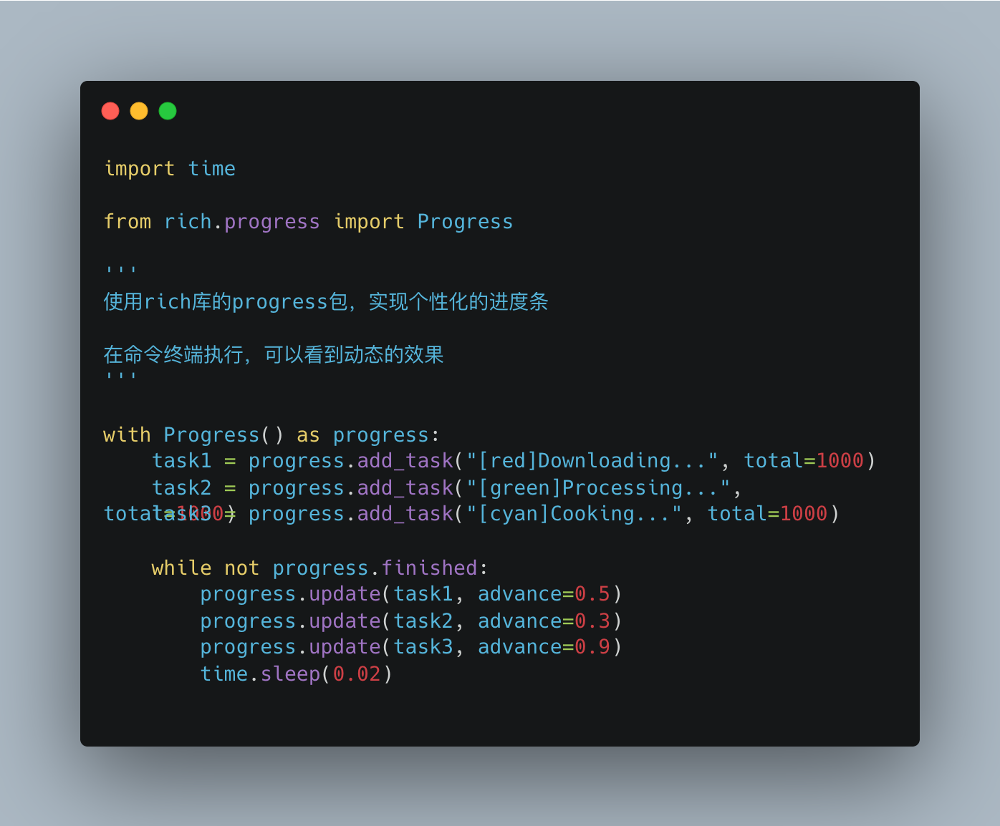
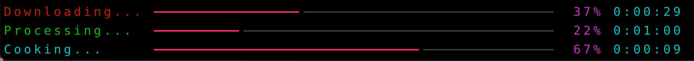

在本篇文章中，我们将使用Python的rich库中的progress包来实现个性化的进度条。进度条不仅可以提升用户体验，还能有效地展示程序的执行状态。通过丰富的自定义选项，您可以根据需求调整进度条的颜色、样式和文本信息，使其更具吸引力和实用性。无论是在命令行界面还是图形用户界面中，个性化的进度条都能为您的项目增添亮点。让我们一起来了解如何实现这一功能吧！

<!--more-->

在许多耗时的场景中，为了提升用户体验，我们通常会添加进度条，以便让用户清楚地知道程序仍在运行。这不仅能缓解用户的焦虑感，还能有效地传达程序的执行状态，使得整个使用过程更加流畅和友好。

# 自定义进度条

著名的`rich`库中就有可自定义的进度条，对此感兴趣的，可以阅读[官方文档](https://rich.readthedocs.io/en/stable/progress.html)就可以非常快速的做出一个自定义的进度条。

代码图片：



完整的代码

```python
import time

from rich.progress import Progress

'''
使用rich库的progress包，实现个性化的进度条

在命令终端执行，可以看到动态的效果
'''

with Progress() as progress:  # 创建一个进度条上下文管理器
    task1 = progress.add_task("[red]Downloading...", total=1000)  # 添加下载任务，设置总量为1000
    task2 = progress.add_task("[green]Processing...", total=1000)  # 添加处理任务，设置总量为1000
    task3 = progress.add_task("[cyan]Cooking...", total=1000)  # 添加烹饪任务，设置总量为1000

    while not progress.finished:  # 当进度条未完成时循环
        progress.update(task1, advance=0.5)  # 更新下载任务的进度，前进0.5
        progress.update(task2, advance=0.3)  # 更新处理任务的进度，前进0.3
        progress.update(task3, advance=0.9)  # 更新烹饪任务的进度，前进0.9
        time.sleep(0.02)  # 暂停0.02秒以模拟任务执行

```

实现的效果



# 探索更多

rich库里除了可以实现进度条以外，它还有需要有意思的能力，比如富文本、控制台美化、文本高亮、提示语、渲染markdown等等。
