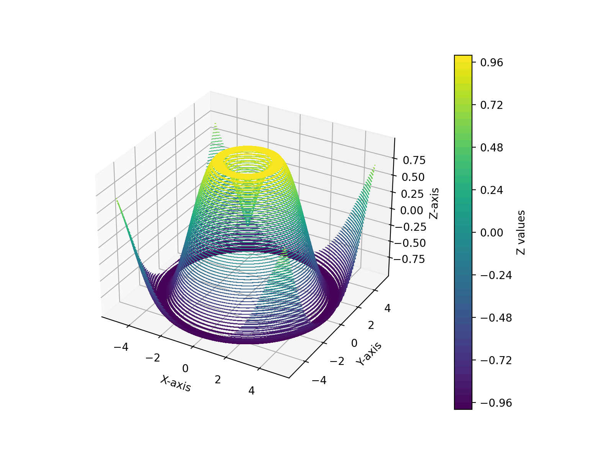

在本篇文章中，我们将快速地使用Python绘制精美的3D等高线图。通过详细的代码示例和注释，您将能够轻松理解每个步骤的实现过程。我们将使用NumPy库进行数值计算，并利用Matplotlib库进行数据可视化。


<!--more-->

# 效果图



# 代码示例

```python
import numpy as np  # 导入NumPy库，用于数值计算
import matplotlib.pyplot as plt  # 导入Matplotlib库，用于绘图
from mpl_toolkits.mplot3d import Axes3D  # 导入3D绘图工具

# 创建x和y的线性空间，从-5到5，共100个点
x = np.linspace(-5, 5, 100)
y = np.linspace(-5, 5, 100)

# 创建网格坐标矩阵X和Y
X, Y = np.meshgrid(x, y)


# 定义函数f(x, y)，计算给定x和y的值
def f(x, y):
    # 返回x和y的距离的正弦值
    return np.sin(np.sqrt(x ** 2 + y ** 2)) 


# 计算网格点X和Y对应的Z值
Z = f(X, Y)

# 创建一个新的图形对象，设置图形大小为8x6英寸
fig = plt.figure(figsize=(8, 6))

# 添加一个3D子图
ax = fig.add_subplot(111, projection='3d')

# 绘制填充等高线图，50表示等高线的数量，cmap设置颜色映射
contour = ax.contourf(X, Y, Z, 50, cmap='viridis')

# 设置X、Y和Z轴的标签
ax.set_xlabel('X-axis')
ax.set_ylabel('Y-axis')
ax.set_zlabel('Z-axis')

# 为等高线图添加颜色条，表示Z值的范围
cbar = fig.colorbar(contour, ax=ax, label='Z values', pad=0.1)

# 调整子图的位置，使其向左移动
plt.subplots_adjust(right=0.85)

# 显示绘制的图形
plt.show()
```

注意：

1、`fig.colorbar(contour, ax=ax, label='Z values', pad=0.1)`这一行代码用于为等高线图添加颜色条，表示Z值的范围。`label`参数用于设置颜色条的标签，`pad`参数用于设置颜色条与图形的距离。

2、`plt.subplots_adjust(right=0.85)`这一行代码用于调整子图的位置，使其向左移动。`right`参数用于设置子图与右侧边界的距离。


通过以上代码示例，您可以轻松地绘制出精美的3D等高线图。