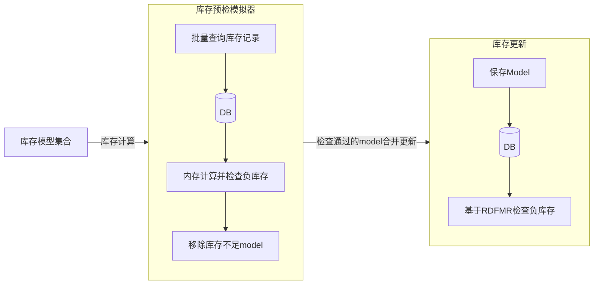
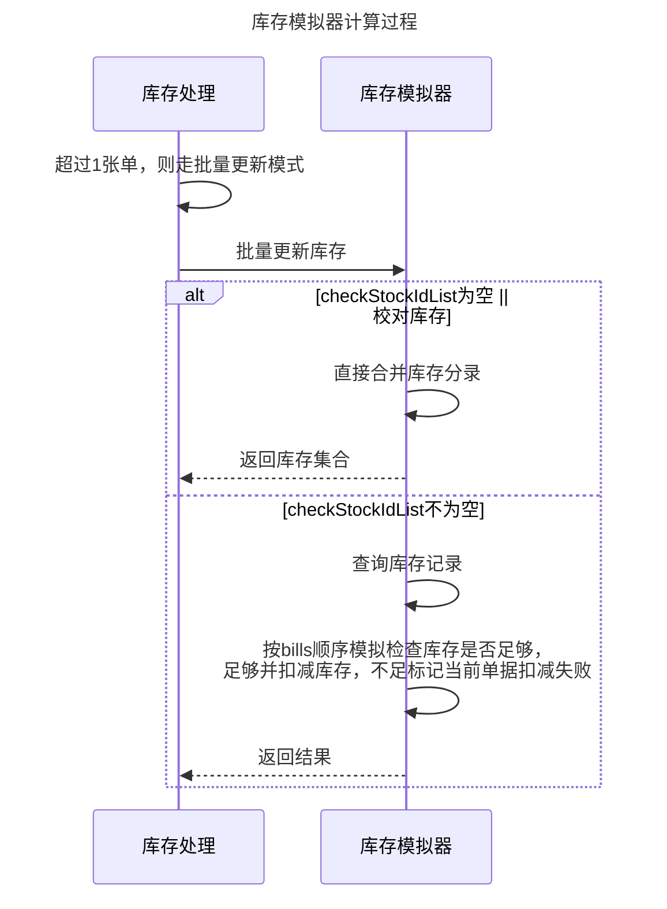
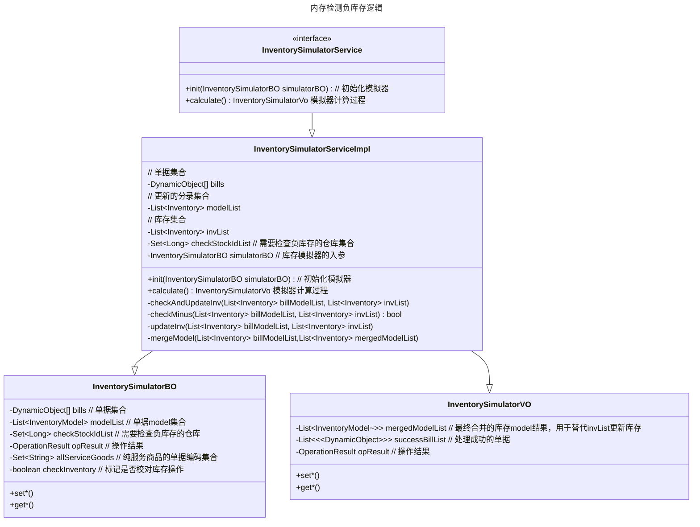

库存作为供应链系统中最为核心、最必须的功能，每一个业务单据的操作都牵扯到库存计算，所以它的处理效率涉及到全部业务的响应时长，一个具备高效的库存计算系统是衡量一款优秀供应链产品的核心指标。

<!--more-->

## 背景

在我们的库存处理中存在一个问题，用户的批量操作会造成慢请求。

之所以会存在这样的一个问题，是库存计算中台在更新库存时，是一张单一张单进行更新，每一张单的耗时不大，可架不住单量大，最终导致整个请求的响应时间被拉长。

那我们在批量时为什么不进行异步更新库存呢？或者是所有单据同时进行更新呢？第一个问题的原因是不同单据中存在相同的商品，异步更新会造成死锁、大量的上下文切换。第二个问题，这里涉及到业务上的关健要求：部分单据库存不足时，另外一部分库存足够的单据需要能够正常的更新成功，即部分成功部分失败。

## 现有逻辑

库存处理主要流程是，先进行数据模型转换，再增量写库，在写完库之后进行负库存判断，如果库存不够则进行库存回滚。

虽然这种方式可以非常靠谱的进行库存更新、负库存判断，可对于大批量单据下执行效率不佳，即使我们对大批量操作在用户侧增加了进度条，缓解了用户对响应时长的感知，但这长时间持有数据库锁，会间接影响到系统中其他用户的使用。特别是电商促销的场景，大部分单据都是同一个商品，这对于库存表而言，就是同一条记录，数据库行级锁将会成为库存更新的瓶颈。

因此对现有流程的治理，必须进行。

## 库存模拟器

大家玩模拟汽车、模拟游戏，都涉及到一个模拟器，它的一个宗旨就是通过模拟方式来反映真实的逻辑。

对于库存模拟器而言，它是模拟了原来数据库库存更新、数据库负库存判断逻辑，无需进行真实的数据库执行即可完成。最终对处理通过没有出现负库存的数据进行落库，未通过的进行收集结果并返回给调用方。

其流程图如下：

上述流程图中涉及到的一个核心思想是，在模拟器中进行库存运算。先进行库存扣减，再判断负库存，若是不存在负库存则直接下一步，反之则将已经扣减过的库存补偿回来。提前做一次库存的检查，并将检查通过的库存模型去更新。

处理时序图如下：

为了更好的说明程序设计，这里贴出类图以供理解：

## 产生的价值

在操作习惯上对用户无感知，在性能表现上（以100张单为例）：
1. 库存处理性能极限提升**61**倍，程序处理耗时由8288毫秒降至136毫秒
2. 对数据库访问次数减少**50**倍，数据库访问次数由200次减少至4次；
3. 对 Redis 访问次数减少**87**倍，Redis访问次数由700次减少至8次。

两种方案的对比：

| 差异点 | 原方案  | 现有方案 |
| :---- | ------- | ------- |
| 性能   | 单张单更新，存在性能瓶颈 | 分批合并更新，更高效 |
| 功能影响| 支持部分成功部分失败| 通过预检实现部分成功部分失败   （在并发场景下会全部失败）|
| 其他影响| | 在全部都成功的场景下，会额外增加预检开销|

应用库存模拟器带来一个极大的好处是提高单据处理库存的效率，特别是在高并发的场景中。不过这里也存在一个弊端，就是通过预检而最终却库存不足时，所有单子都会处理失败。

方案的可推广性，对于频繁进行数据库操作的时候，可以考虑利用内存来降低对数据库的频繁访问，在一定程度上可以获得超额回报。