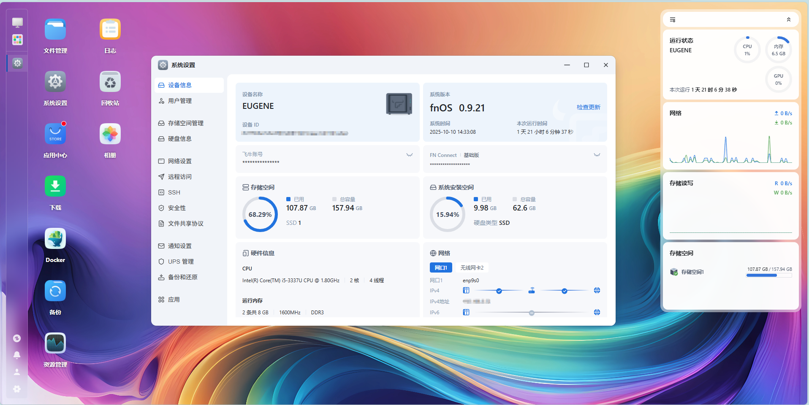

## 背景

自打小孩出生以后，手机内存不断告警，一个家庭存储设备（NAS）是时候安排起来了。

第一考虑到的就是群晖这种现成的产品，买来即用。后来在查阅资料的过程中，意外地发现有很多人推荐飞牛这个操作系统os，用于个人做家用存储。

立马去官网看了这个操作系统，产品介绍、使用方式非常的详细，社群也很活跃，里面积累了大量用户及使用过程中遇到的问题，这里都有解决方案，最关键的是创始人明确说明了他的盈利模式，不会依靠在操作系统中植入广告来赚钱。而我恰好身边有一台大学时用的旧笔记本（戴尔灵越5421），而且是有SSD的，这对于存储而言，速度会更快。

因此，我决定来试一试[飞牛](https://www.fnnas.com/) 操作系统。

## 开整

由于过去经常折腾windows系统，这装系统对我而言，就是手拿把捏，根据官网的文档制作了U盘启动盘，旧电脑里的资料早就被我清空了，那就直接开始安装。

安装过程非常的顺利，也是由于这个系统经过多年的迭代，目前已经非常地成熟了，所以在这个过程中没有遇到太多问题，安装并直接开机成功。

进入操作界面非常的丝滑，UI颜值十分在线，并且当我发现里面还有docker这类工具时，不由的佩服这个产品的作者，给这个操作系统带来更多的可玩性，它不仅仅是一个存储服务器。

官网直接提供了非常详细的[安装教程](https://help.fnnas.com/articles/fnosV1/start/install-os.md)，可以看到这个教程竟然是markdown的，哇噻，说明作者很可能是一个技术流，nice。

## 踩坑

踩坑，这似乎是必然的，就看大小啦。

我遇到一个小坑，电脑重启后，有一定概率不能识别到IP地址，不过我最后也是在社区论坛找到了答案。

这就是社区活跃的好处，当你遇到的问题可能别人已经解决了，或者别人能给你提供有效的解决思路。

## 交作业

安装飞牛OS已经快两个月了，昨天把服务器重启了一下，将光驱挂了一块1T的HDD硬盘。后面计划将这块1T的硬盘用于存储，而之前的SSD仅用来做缓存，进一步提升服务器的速率。

