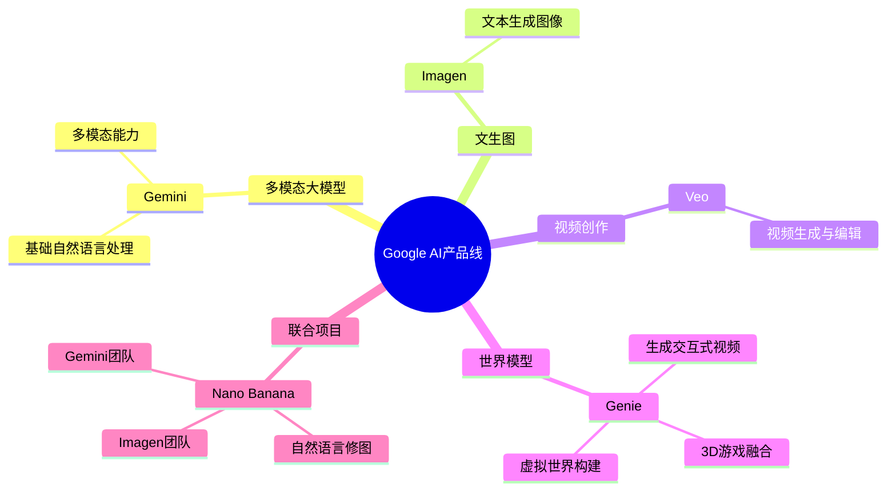

原来谷歌在AI领域这么强

nano banana的火爆，我重新去查看了一下谷歌在AI领域中的成绩。

细看吓一跳，他家在这个领域可谓是全面开花。

无论是文生图imagen、视频创作veo，基本自然语言Gemini，这将多模态的各类主角都补齐了。甚至有一个世界模型Genie，它不仅仅生成视频，还增加了可玩的部分，与虚拟世界融合，将人物放入3D游戏中去，这无疑带来了更多的想象空间，未来AI和web3打通，这也即将到来。

据说在Google内部，这些不同的大模型分别是不同的团队在负责，而这次的nano banana则是由imagen团队与Gemini团队联合打造。

曾经大家都在质疑Google在AI这场革命中掉队了，现在他用产品给出有力一击。

