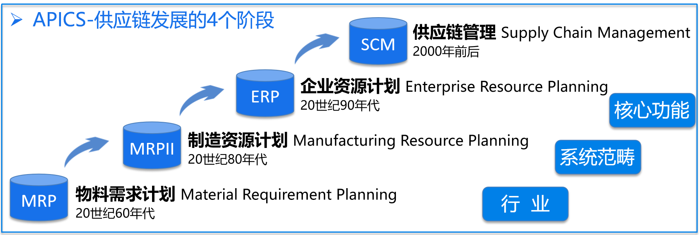
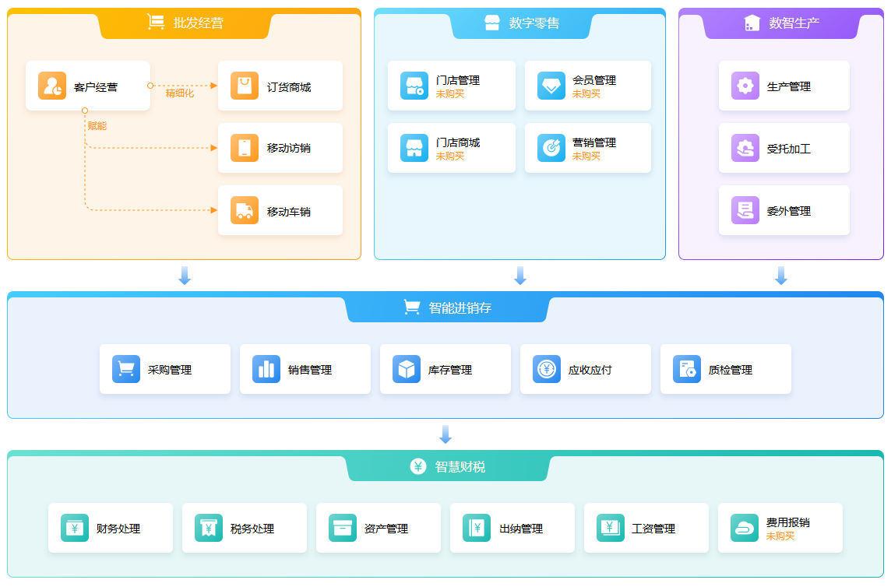

供应链是围绕核心企业，通过对信息流、物流、资金流的控制，从采购原材料开始，制成中间产品及最终产品，最后通过销售网络把产品送到消费者手中，并将供应商、制造商、分销商、零售商直到最终用户连成一个整体的网链结构和模式。————马士华 ·《供应链管理》

<!--more-->

笔者从事供应链开发已经7年时间，期间主要都是在负责库存的核心业务。库存业务也是被称为“供应链之魂”。

## 供应链发展史

供应链 等于 物流吗？

这是对供应链的一大误区。物流只是供应链环节中的一个节点。

咱们来捋一捋供应链的发展史，好让大家有一个直观的认识。

从权威机构APICS的定义中，供应链的发展经历了4个阶段。

- 20世纪60年代的物料需求计划（MMRP）
- 20世纪80年代的制造资源计划（MRPⅡ）
- 20世纪90年代的企业资源计划（ERP）
- 2000年前后的供应链管理（SCM）

最近的世纪是2000年，难道供应链发展到2000年后就一直没有变化么，那肯定不是的。**数字化智能生态圈是当前正在经历的阶段，由数字技术革命所驱动**。供应链不再是一条简单的“链”，而是一个互联互通的、智能的“生态网络”。

其中涉及的技术包括：物联网（IoT）、大数据、人工智能（AI）、云计算、区块链和机器人流程自动化（RPA）等。

## 星辰供应链

咱们在这里简单介绍一下金蝶云星辰供应链。

星辰供应链管理系统：实现采购、销售、库存、资金全链路管理，数据赋能助力企业智慧经营。

> 上面这张图中的进销存就是本文中的供应链，在这里暂且把它们认为是同一个概念。

从上面这张图可以看出，供应链的上层业务有批发经营、数字零售、数智生产，在它的下游是财税部分，这更加突出供应链在管理系统中重要性。

通常供应链是一个企业中最基础且最重要的部分，在系统中也是如此。从购买数据来看，供应链占比远远超过其它模块，这是用户用钱投票的结果。

## 后续计划

从星辰供应链开始，围绕采购、销售、库存三个维度一层一层展开，给大家看到供应链的全貌。

大家一起共同进步。
